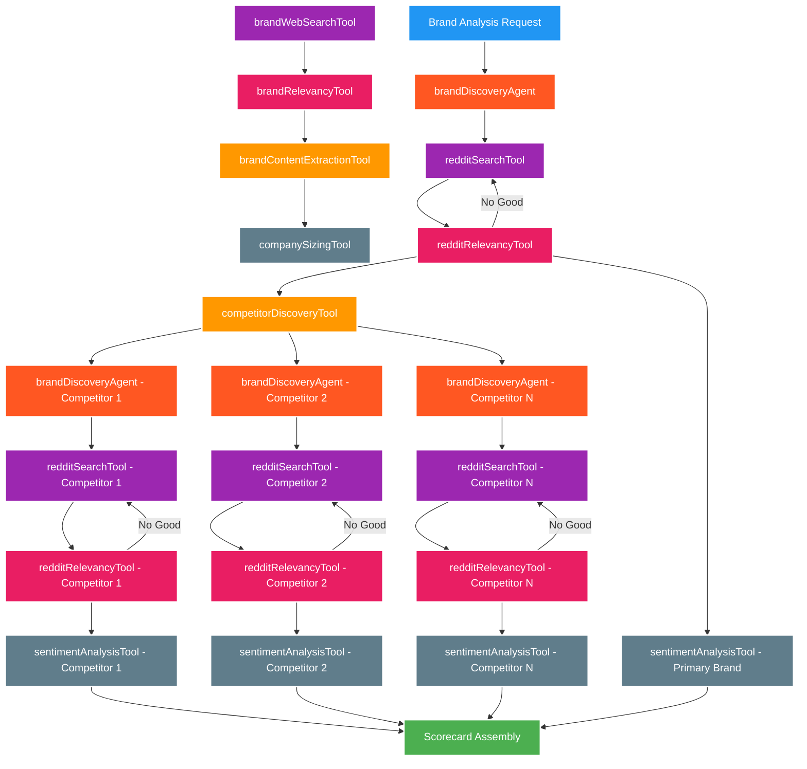

# Deep Research Assistant with Mastra

This project implements an advanced AI deep research assistant using Mastra's workflows and agent capabilities. It creates an interactive, human-in-the-loop research system that allows users to explore topics, evaluate results, and generate comprehensive reports.

The system also includes a specialized **Brand Analysis Agent** that combines brand discovery with Reddit sentiment analysis and competitor identification to create comprehensive brand scorecards.

## Implementation Approach

The research assistant is built on Mastra's workflows architecture for better orchestration and human interaction:

1. **Workflow-Based Architecture**:
   - `mainWorkflow`: Coordinates the entire research process
   - `researchWorkflow`: Handles the core research functionality with suspend/resume for user interaction
   - Human-in-the-loop experience with approval gates and iterative research

2. **Research Agent with Custom Tools**:
   - `webSearchTool`: Searches the web using the Exa API for relevant information
   - `evaluateResultTool`: Assesses result relevance to the research topic
   - `extractLearningsTool`: Identifies key learnings and generates follow-up questions

3. **Report Generation**:
   - `reportAgent`: Transforms research findings into comprehensive markdown reports
   - Returns report content directly after user approval of research quality

## Key Benefits of Mastra vNext Implementation

1. **True Human-in-the-Loop Research**: Users can guide the research process, approve findings, and iterate when needed

2. **Suspend/Resume Capabilities**: The workflow can pause at strategic points to collect user input and feedback

3. **Structured Workflow**: Clear separation between research, approval, and report generation phases

4. **Resilient Operation**: Robust error handling and fallback mechanisms when web searches fail

5. **Modular Design**: Each component (workflows, agents, tools) can be maintained and upgraded independently

## How to Use

```bash
# Install dependencies
npm install

# Run the research assistant
npm run dev
```

Follow the interactive prompts:

1. Enter your research topic
2. Review the research findings
3. Approve or reject the research results
4. If approved, a comprehensive report will be returned as output

## Required Environment Variables

Create a `.env` file with:

```
OPENAI_API_KEY=""
EXA_API_KEY="your-exa-api-key"
```

## Brand Analysis Agent Workflow

The Brand Analysis Agent provides comprehensive brand intelligence by combining multiple data sources and analysis techniques:



### Color Legend:
- 🔵 **Blue**: Start/Input (Brand Analysis Request)
- 🟢 **Green**: End/Output (Scorecard Assembly)
- 🔴 **Red**: brandDiscoveryAgent (Brand Intelligence)
- 🟣 **Purple**: redditSearchTool (Reddit Data Collection)
- 🟠 **Orange**: competitorDiscoveryTool (Competitor Identification)
- 🔘 **Blue-Grey**: sentimentAnalysisTool (Sentiment Analysis)
- 🟡 **Pink**: redditRelevancyTool (Thread Relevance Evaluation)

### Key Features:
- **Sequential Processing**: Each phase builds on previous results
- **Enhanced Competitor Analysis**: Individual brand discovery and sentiment analysis for each competitor
- **Reddit Integration**: Comprehensive Reddit search and sentiment analysis
- **Sentiment Scoring**: 0-10 scale sentiment scores for brand and competitors
- **Comprehensive Output**: Complete scorecard JSON matching frontend interface

## Required Dependencies

- `@mastra/core`: Core Mastra functionality with vNext workflows
- `@ai-sdk/openai`: OpenAI models integration
- `exa-js`: Exa API client for web search and Reddit analysis
- `zod`: Schema definition and validation for workflows
